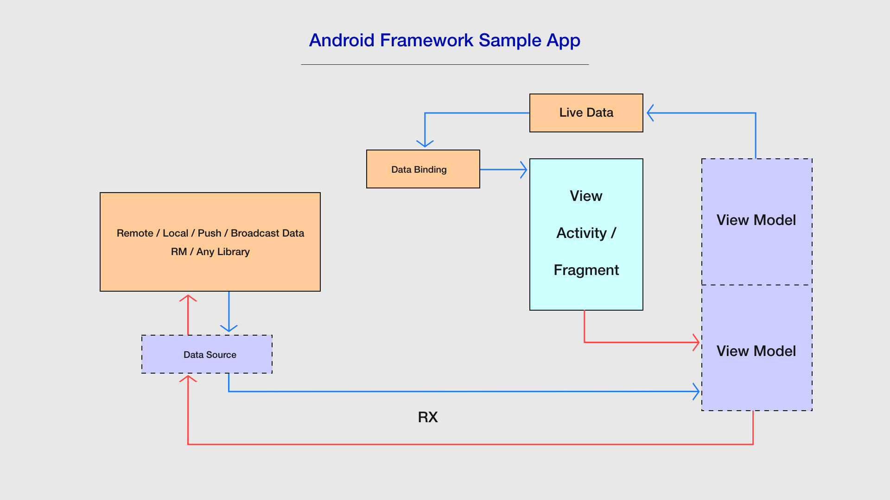

# Android Framework Sample Appliocation
This app is to demonstrate usage of the features of W3Engineers Android
framework.
Below you can find the architecture of the application which is recommended
to be used when developers are developing any new application.
  
